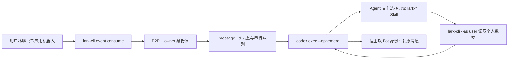

# Feishu Codex IM Bot

一个单用户、P2P-only 的飞书个人助手机器人宿主：`lark-cli` 负责实时收信和 Bot 回复，`codex exec` 负责理解问题，并通过已安装的飞书 Skills/CLI 读取当前授权用户的数据。

## 身份模型

| 环节 | 身份 | 原因 |
|---|---|---|
| 接收 `im.message.receive_v1` | Bot | 事件属于飞书应用机器人 |
| 查询“我的待办/日历/消息/文档” | User | 个人资源必须使用当前用户的 `user_access_token` |
| 回复当前私聊消息 | Bot | 回复以应用机器人名义发出 |

启动时会从 `lark-cli auth status --json --verify` 解析当前授权用户的 `open_id`。只有这个用户发给机器人的 P2P 消息会进入 Codex；群聊、其他用户和 Bot 消息全部丢弃。

## 数据流



## 当前安全边界

- 仅当前已授权用户；仅 P2P；仅用户发出的消息。
- Codex 使用 `workspace-write` sandbox，但可写范围只限 `im_bot/runtime`；之所以不用
  `read-only`，是因为本机 Codex 的只读沙箱会禁用 `lark-cli` 所需的网络访问。
- Codex 只允许读取，不允许发送消息或修改飞书数据。
- 用户 token 的验证和自动刷新只由宿主执行：启动时、每 10 分钟及每次 Codex
  调用前各有串行闸；Codex 内禁止执行 login/logout/带 `--verify` 的 auth 命令。
- 唯一外部写入是宿主对当前消息的 Bot 回复。
- 处理成功后把 `message_id` 写入本地 `var/state.json`，权限为 `0600`。
- 回复使用稳定 idempotency key，进程重启或事件重投不会重复回复。
- 日志只记录 ID 的哈希前缀，不记录消息正文、原始 ID 或 Token。
- 宿主不按关键词把请求固定路由到任务或日历。Codex 根据语义自主选择信息源；未明确
  限定为“飞书任务/任务中心”的“待办”，默认从今天截至当前的私聊和群聊消息中识别
  指派、待回复问题、承诺跟进、期限和待决事项，原生任务与日历只作为可选补充。
- `runtime/AGENTS.md` 位于 Codex 实际工作目录，确保每次非交互运行都加载同一套身份、
  只读边界和自主规划规则；关键规则也会随每次请求动态注入。

这仍是单用户 MVP。多用户版本必须为每个飞书用户建立独立 OAuth/token 映射，不能让其他用户复用宿主机器上的个人 user token。

## 前置条件

1. `lark-cli` 已配置应用，Bot 和用户身份均为 ready。
2. 飞书后台已订阅 `im.message.receive_v1`，私聊权限至少包含 `im:message.p2p_msg:readonly`。
3. Bot 回复权限包含 `im:message:send_as_bot`。
4. 本机 `codex` 已登录；`codex exec` 可用。
5. 全局已安装所需的 `lark-*` Skills。
6. Node.js 20+。

## 本地运行

```bash
cd im_bot
npm run test
npm run check
npm run codex:smoke
npm start
```

`npm run codex:smoke` 会让 Codex 在只读模式下检查当前飞书用户授权，只输出有效/无效，不发送飞书消息。

## macOS 常驻运行

```bash
cd im_bot
npm run service:install
npm run service:status
```

日志：

```text
im_bot/logs/launchd.out.log
im_bot/logs/launchd.err.log
```

卸载：

```bash
npm run service:uninstall
```

launchd 配置会复制到 `~/Library/LaunchAgents/com.local.im-data-collection.im-bot.plist`。配置中只有程序路径和非敏感运行参数，不保存飞书或 OpenAI 密钥。

## 配置

复制 `.env.example` 中需要的变量到启动环境。当前实现不自动读取 `.env`，避免在没有依赖的情况下自行解释 shell 格式；本地调试可以在终端 `export`，launchd 安装器会写入必要的可执行文件路径。

常用变量：

| 变量 | 默认值 | 说明 |
|---|---|---|
| `IM_BOT_CODEX_SANDBOX` | `workspace-write` | 只允许写 runtime 目录并开启网络；不要扩大到 danger-full-access |
| `IM_BOT_CODEX_MODEL` | 空 | 空表示沿用 Codex 当前配置 |
| `IM_BOT_CODEX_TIMEOUT_MS` | `600000` | 单次处理超时（10 分钟） |
| `IM_BOT_AUTH_VERIFY_INTERVAL_MS` | `600000` | 宿主串行验证/刷新用户 token 的周期 |
| `IM_BOT_ALLOWED_USER_OPEN_ID` | 当前授权用户 | 可显式钉住 owner；不要提交到仓库 |
| `IM_BOT_MAX_QUEUE` | `20` | 最大待处理消息数 |
| `IM_BOT_REPLY_ON_ERROR` | `true` | Codex 失败时是否回复通用错误消息 |
| `IM_BOT_ALLOW_USER_WRITES` | `false` | 当前版本必须保持 false |

## 生产化待办

- 用户确认协议与安全的外部写操作白名单。
- 多用户 OAuth/token 隔离。
- 结构化审计、指标、告警和成本台账。
- 更可靠的持久队列与失败重放。
- 附件、卡片和语音消息处理。
- 将 Codex 可调用的飞书能力收敛到显式只读工具代理，而不是通用 shell。
- Linux systemd / Docker 部署。
